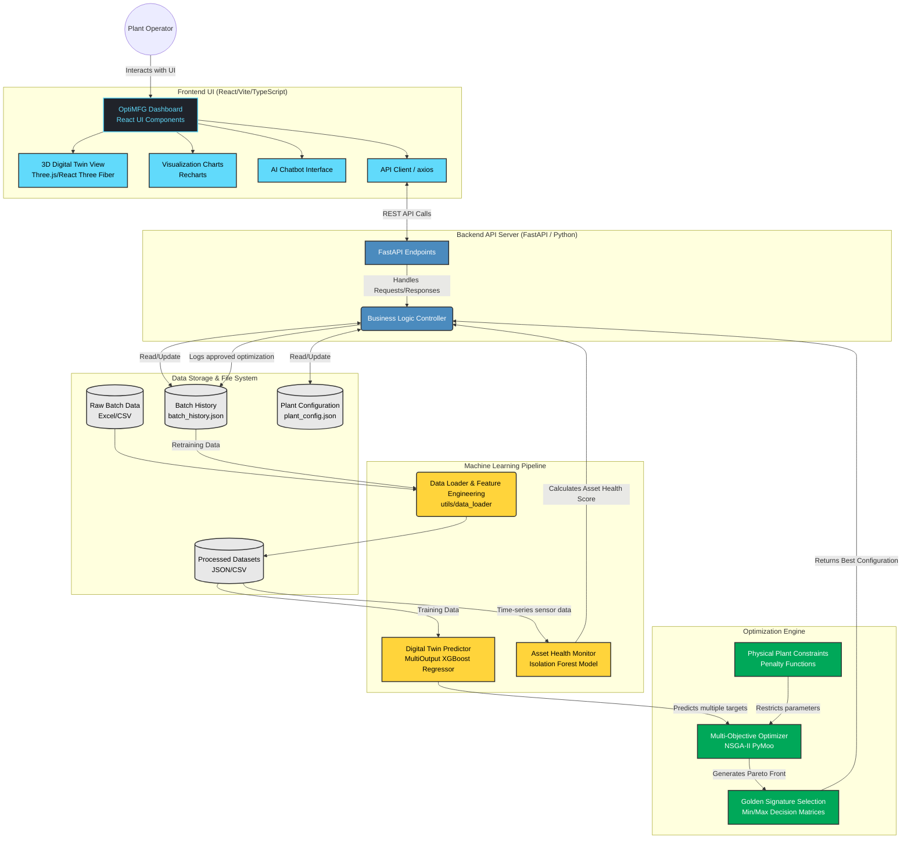

# OptiMFG Architecture Diagram

This document contains the complete system architecture diagram for the **OptiMFG** platform based on the codebase analysis. The architecture leverages a React-based frontend and a Python (FastAPI) backend integrated with complex machine learning models (XGBoost, Isolation Forest) and an optimization engine (NSGA-II).

## System Architecture

### Component Details

**1. Frontend Application:**
*   Built with React, Vite, and TypeScript.
*   **3D Digital Twin View:** Uses Three.js and React Three Fiber to visually simulate the physical hardware and status flags (like overheating indicators).
*   **Charts:** Recharts to render parallel coordinates, objective distributions, and batch history metrics.
*   **AI Chatbot:** An interface connected to the LLM features of the platform, designed to answer plain English questions based on historical logs and optimization results.

**2. Backend Server (FastAPI):**
*   Exposes endpoints to retrieve configurations, run "What-If" simulations, trigger the NSGA-II optimizer, and record historical runs.
*   Serves as the broker between the interactive web dashboard and the heavier ML/Math logic.

**3. Machine Learning Pipeline:**
*   **Digital Twin Predictor:** Uses Extreme Gradient Boosting (`XGBRegressor`) wrapped in a `MultiOutputRegressor` to simultaneously predict multiple target metrics (Quality Score, Energy Consumption, Carbon Emissions) based on 8 key machine parameters.
*   **Asset Health Monitor:** Applies an **Isolation Forest** unsupervised algorithm on raw sensor time-series data to detect anomalous spikes, which linearly penalizes the equipment's health score.
*   **Feature Engineering:** Extracts meta-features like `Energy_per_batch` (time $\times$ power) and `Reliability Index` based on variance statistics.

**4. Optimization Engine:**
*   **NSGA-II (pymoo):** The core evolutionary algorithm exploring the 8-dimensional parameter space to generate a Pareto Front of optimal configurations (maximizing quality while minimizing carbon and footprint).
*   **Decision Matrix:** Sorts the Pareto solutions into actionable outcomes like "Energy Saving", "Quality Priority", or a "Balanced" mathematical hybrid.
*   **Feedback Loop:** By accepting or rejecting predictions, plant operators influence dynamic weights applied during consecutive optimization runs.
